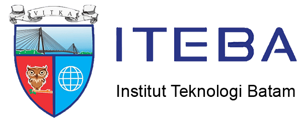
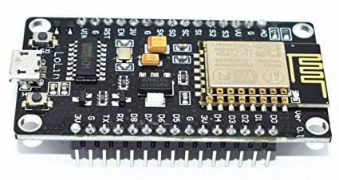
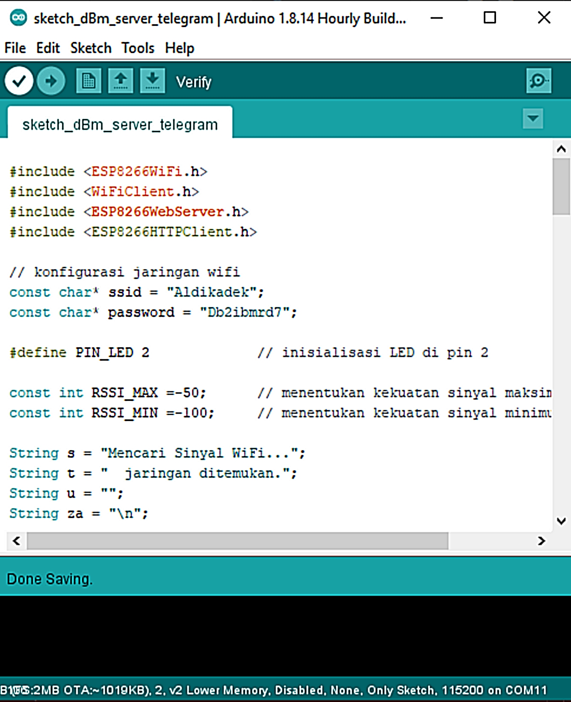
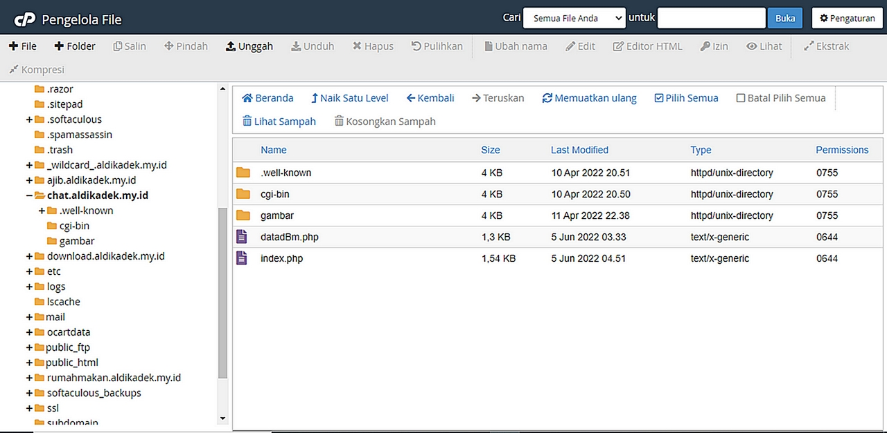

# Tugas Besar Komunikasi Data Kelompok 1

### Anggota: 1. Johanes Wilian Ang (1822002) 2. Erwin Erikson (1822003) 3. Johnny (1822004) 4. Andrian Syah (1922009)

 

# __dBmWiFi Server BotTelegram__
Program memindai jaringan WiFi dan mengetahui kekuatan sinyal masing-masing jaringan dalam dBm menggunakan NodeMCU V3.

Data hasil pemindaian NodeMCU V3 akan dikirim ke Telegram menggunakan channel BotFather melalui webserver setelah pengguna mengirim perintah ke bot sesuai intruksi di "/info".

Untuk menerima pembaruan pada bot ini menggunakan metode Webhook. 

### Langkah-langkah:
<ol>
    <li>Persiapkan perangkat NodeMCU V3.   </li>
    <li>Upload sketch_dBm_server_telegram ke NodeMCU V3 menggunakan Arduino IDE.   </li>
    <li>Upload file <b>datadBm.php</b> ke webserver di subdomain <b>chat.aldikadek.my.id</b> </li>
</ol>

